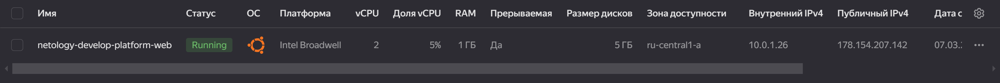
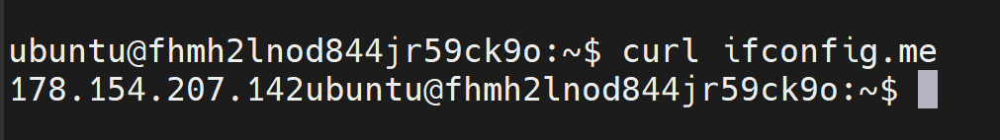
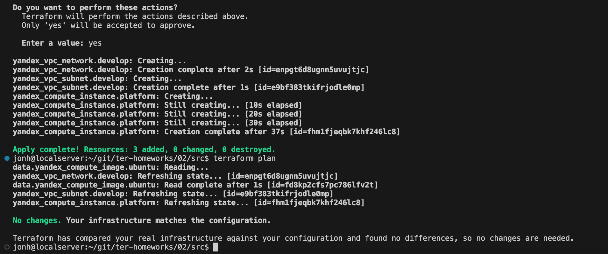
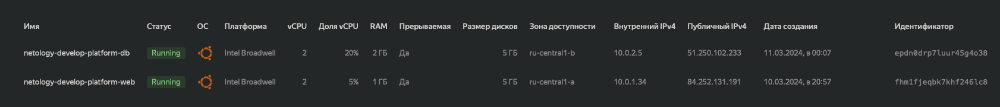
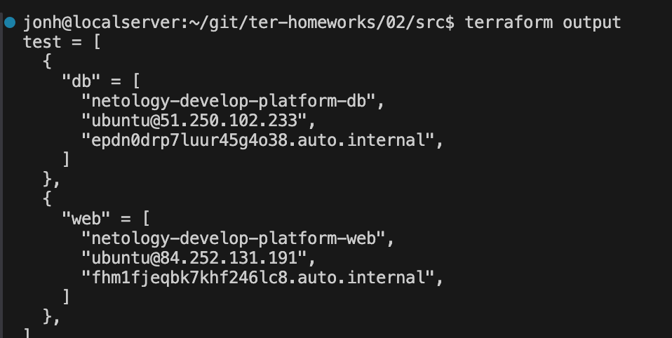
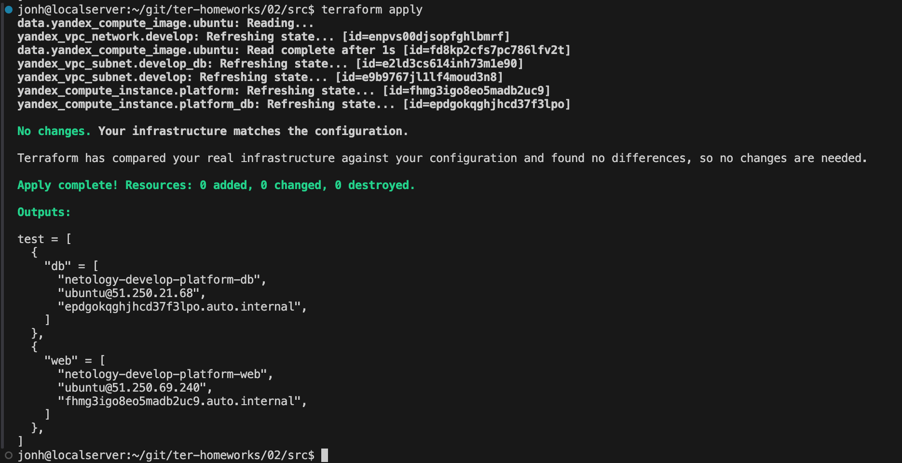
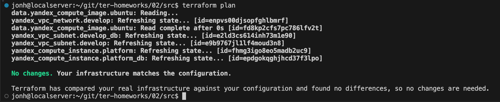

# Домашнее задание к занятию «Основы Terraform. Yandex Cloud»

### Задание 0

1. Ознакомьтесь с [документацией к security-groups в Yandex Cloud](https://cloud.yandex.ru/docs/vpc/concepts/security-groups?from=int-console-help-center-or-nav). 
Этот функционал понадобится к следующей лекции.

### Задание 1
В качестве ответа всегда полностью прикладывайте ваш terraform-код в git.  Убедитесь что ваша версия **Terraform** =1.5.Х (версия 1.6.Х может вызывать проблемы с Яндекс провайдером) 

1. Изучите проект. В файле variables.tf объявлены переменные для Yandex provider.
2. Создайте сервисный аккаунт и ключ. [service_account_key_file](https://terraform-provider.yandexcloud.net).
3. Сгенерируйте новый или используйте свой текущий ssh-ключ. Запишите его открытую(public) часть в переменную **vms_ssh_public_root_key**.
4. Инициализируйте проект, выполните код. Исправьте намеренно допущенные синтаксические ошибки. Ищите внимательно, посимвольно. Ответьте, в чём заключается их суть.
```
"Platform "standart-v4" not found "
Платформы такой не существует верно будет указать standard-v1
"allowed core number: 2, 4 "
Не правильно указано колличество ядер CPU , допустимо 2 , 4 ...
```
5. Подключитесь к консоли ВМ через ssh и выполните команду ``` curl ifconfig.me```.
Примечание: К OS ubuntu "out of a box, те из коробки" необходимо подключаться под пользователем ubuntu: ```"ssh ubuntu@vm_ip_address"```. Предварительно убедитесь, что ваш ключ добавлен в ssh-агент: ```eval $(ssh-agent) && ssh-add``` Вы познакомитесь с тем как при создании ВМ создать своего пользователя в блоке metadata в следующей лекции.;


6. Ответьте, как в процессе обучения могут пригодиться параметры ```preemptible = true``` и ```core_fraction=5``` в параметрах ВМ.
```
preemptible = true - прерываемая виртуальная машина - выключится по прошествии 24 часов.
Позволяет избежать неконтролируемых расходов , например если забыли выключить вручную.
core_fraction=5 - уровень производительности vCPU , позволяет сэкономить в процессе обучения .
Этот уровень определяет в процентном соотношении долю вычислительного времени физических ядер, которую гарантирует vCPU. 
```
В качестве решения приложите:

- скриншот ЛК Yandex Cloud с созданной ВМ, где видно внешний ip-адрес;
- скриншот консоли, curl должен отобразить тот же внешний ip-адрес;
- ответы на вопросы.

### Задание 2

1. Замените все хардкод-**значения** для ресурсов **yandex_compute_image** и **yandex_compute_instance** на **отдельные** переменные. К названиям переменных ВМ добавьте в начало префикс **vm_web_** .  Пример: **vm_web_name**.
2. Объявите нужные переменные в файле variables.tf, обязательно указывайте тип переменной. Заполните их **default** прежними значениями из main.tf. 
3. Проверьте terraform plan. Изменений быть не должно. 

### variables.tf
```text
...
variable "vpc_name" {
  type        = string
  default     = "develop"
  description = "VPC network & subnet name"
}

variable "vm_web_name" {
  type        = string
  default     = "netology-develop-platform-web"
  description = "Name VM"
}

variable "vm_web_core" {
  type        = number
  default     = 2
  description = "Cores"
}

variable "vm_web_memory" {
  type        = number
  default     = 1
  description = "Memory"
}

variable "vm_web_core_fraction" {
  type        = number
  default     = 5
  description = "Core fraction"
}

variable "vm_web_preemptible" {
  type        = bool
  default     = true
  description = "Preemptible"
}

variable "vm_web_platform" {
  type        = string
  default     = "standard-v1"
  description = "Platform standard"
}

variable "vm_web_family" {
  type        = string
  default     = "ubuntu-2004-lts"
  description = "VM family"
}

variable "vm_web_nat" {
  type        = bool
  default     = true
  description = "Netvork nat"
}

###ssh vars

variable "vm_web_ssh_key" {
  type        = string
  default     = null
  description = "ssh-key for VM"
}

```
### main.tf
```text
resource "yandex_vpc_network" "develop" {
  name = var.vpc_name
}
resource "yandex_vpc_subnet" "develop" {
  name           = var.vpc_name
  zone           = var.default_zone
  network_id     = yandex_vpc_network.develop.id
  v4_cidr_blocks = var.default_cidr
}


data "yandex_compute_image" "ubuntu" {
  family = var.vm_web_family
}
resource "yandex_compute_instance" "platform" {
  name        = var.vm_web_name
  platform_id = var.vm_web_platform
  resources {
    cores         = var.vm_web_core
    memory        = var.vm_web_memory
    core_fraction = var.vm_web_core_fraction
  }
  boot_disk {
    initialize_params {
      image_id = data.yandex_compute_image.ubuntu.image_id
    }
  }
  scheduling_policy {
    preemptible = var.vm_web_preemptible
  }
  network_interface {
    subnet_id = yandex_vpc_subnet.develop.id
    nat       = var.vm_web_nat
  }

  metadata = {
    serial-port-enable = 1
    ssh-keys           = var.vm_web_ssh_key
  }

}
```



### Задание 3

1. Создайте в корне проекта файл 'vms_platform.tf' . Перенесите в него все переменные первой ВМ.
2. Скопируйте блок ресурса и создайте с его помощью вторую ВМ в файле main.tf: **"netology-develop-platform-db"** ,  ```cores  = 2, memory = 2, core_fraction = 20```. Объявите её переменные с префиксом **vm_db_** в том же файле ('vms_platform.tf').  ВМ должна работать в зоне "ru-central1-b"
3. Примените изменения.

### vms_platform.tf
```text
variable "vm_db_name" {
  type        = string
  default     = "netology-develop-platform-db"
  description = "Name vm_db"
}

variable "vm_db_core" {
  type        = number
  default     = 2
  description = "Cores vm_db"
}

variable "vm_db_memory" {
  type        = number
  default     = 2
  description = "Memory vm_db"
}

variable "vm_db_core_fraction" {
  type        = number
  default     = 20
  description = "Core fraction vm_db"
}

variable "vm_db_preemptible" {
  type        = bool
  default     = true
  description = "Preemptible vm_db"
}

variable "vm_db_platform" {
  type        = string
  default     = "standard-v1"
  description = "Platform standard vm_db"
}

variable "vm_db_family" {
  type        = string
  default     = "ubuntu-2004-lts"
  description = "VM family vm_db"
}

variable "vm_db_nat" {
  type        = bool
  default     = true
  description = "Netvork nat vm_db"
}

variable "vm_db_zone" {
  type        = string
  default     = "ru-central1-b"
  description = "Zone vm_db"
}

variable "db_subnet" {
  type        = string
  default     = "develop-db"
  description = "db_subnet"
}

variable "vm_db_cidr" {
  type        = list(string)
  default     = ["10.0.2.0/24"]
  description = "https://cloud.yandex.ru/docs/vpc/operations/subnet-create"
}

###ssh vars

variable "vm_db_ssh_key" {
  type        = string
  default     = null
  description = "ssh-key for VM db"
}
```
### main.tf
```text
resource "yandex_vpc_network" "develop" {
  name = var.vpc_name
}

resource "yandex_vpc_subnet" "develop" {
  name           = var.vpc_name
  zone           = var.default_zone
  network_id     = yandex_vpc_network.develop.id
  v4_cidr_blocks = var.default_cidr
}

resource "yandex_vpc_subnet" "develop-db" {
  name           = var.db_subnet
  zone           = var.vm_db_zone
  network_id     = yandex_vpc_network.develop.id
  v4_cidr_blocks = var.vm_db_cidr
}

data "yandex_compute_image" "ubuntu" {
  family = var.vm_web_family
}

resource "yandex_compute_instance" "platform" {
  name        = var.vm_web_name
  platform_id = var.vm_web_platform
  resources {
    cores         = var.vm_web_core
    memory        = var.vm_web_memory
    core_fraction = var.vm_web_core_fraction
  }
  boot_disk {
    initialize_params {
      image_id = data.yandex_compute_image.ubuntu.image_id
    }
  }
  scheduling_policy {
    preemptible = var.vm_web_preemptible
  }
  network_interface {
    subnet_id = yandex_vpc_subnet.develop.id
    nat       = var.vm_web_nat
  }

  metadata = {
    serial-port-enable = 1
    ssh-keys           = var.vm_web_ssh_key
  }
}

resource "yandex_compute_instance" "platform_db" {
  name        = var.vm_db_name
  platform_id = var.vm_db_platform
  zone           = var.vm_db_zone
  resources {
    cores         = var.vm_db_core
    memory        = var.vm_db_memory
    core_fraction = var.vm_db_core_fraction
  }
  boot_disk {
    initialize_params {
      image_id = data.yandex_compute_image.ubuntu.image_id
    }
  }
  scheduling_policy {
    preemptible = var.vm_db_preemptible
  }
  network_interface {
    subnet_id = yandex_vpc_subnet.develop-db.id
    nat       = var.vm_db_nat
  }
  
  metadata = {
    serial-port-enable = 1
    ssh-keys           = var.vm_db_ssh_key
  }
}
```

### Задание 4

1. Объявите в файле outputs.tf **один** output , содержащий: instance_name, external_ip, fqdn для каждой из ВМ в удобном лично для вас формате.
2. Примените изменения.

В качестве решения приложите вывод значений ip-адресов команды ```terraform output```.


### Задание 5

1. В файле locals.tf опишите в **одном** local-блоке имя каждой ВМ, используйте интерполяцию ${..} с НЕСКОЛЬКИМИ переменными по примеру из лекции.
2. Замените переменные внутри ресурса ВМ на созданные вами local-переменные.
3. Примените изменения.

### добавляем переменные в variables.tf
```text
...
variable "instance" {
  type        = string
  default = "netology-develop-platform"
}

variable "name_web" {
  type        = string
  default = "web"
}

variable "name_db" {
  type        = string
  default = "db"
}
```
### описываем в locals.tf 
```text
locals {
  vm_web_instance_name = "${var.instance}-${var.name_web}"
  vm_db_instance_name  = "${var.instance}-${var.name_db}"
}
```
### применяем 


### main.tf
```text
resource "yandex_vpc_network" "develop" {
  name = var.vpc_name
}

resource "yandex_vpc_subnet" "develop" {
  name           = var.vpc_name
  zone           = var.default_zone
  network_id     = yandex_vpc_network.develop.id
  v4_cidr_blocks = var.default_cidr
}

resource "yandex_vpc_subnet" "develop_db" {
  name           = var.db_subnet
  zone           = var.vm_db_zone
  network_id     = yandex_vpc_network.develop.id
  v4_cidr_blocks = var.vm_db_cidr
}

data "yandex_compute_image" "ubuntu" {
  family = var.vm_web_family
}

resource "yandex_compute_instance" "platform" {
  name        = local.vm_web_instance_name
  platform_id = var.vm_web_platform
  resources {
    cores         = var.vm_web_core
    memory        = var.vm_web_memory
    core_fraction = var.vm_web_core_fraction
  }
  boot_disk {
    initialize_params {
      image_id = data.yandex_compute_image.ubuntu.image_id
    }
  }
  scheduling_policy {
    preemptible = var.vm_web_preemptible
  }
  network_interface {
    subnet_id = yandex_vpc_subnet.develop.id
    nat       = var.vm_web_nat
  }

  metadata = {
    serial-port-enable = 1
    ssh-keys           = var.vm_web_ssh_key
  }
}

resource "yandex_compute_instance" "platform_db" {
  name        = local.vm_db_instance_name
  platform_id = var.vm_db_platform
  zone           = var.vm_db_zone
  resources {
    cores         = var.vm_db_core
    memory        = var.vm_db_memory
    core_fraction = var.vm_db_core_fraction
  }
  boot_disk {
    initialize_params {
      image_id = data.yandex_compute_image.ubuntu.image_id
    }
  }
  scheduling_policy {
    preemptible = var.vm_db_preemptible
  }
  network_interface {
    subnet_id = yandex_vpc_subnet.develop_db.id
    nat       = var.vm_db_nat
  }
  
  metadata = {
    serial-port-enable = 1
    ssh-keys           = var.vm_db_ssh_key
  }
}
```
### Задание 6

1. Вместо использования трёх переменных  ".._cores",".._memory",".._core_fraction" в блоке  resources {...}, объедините их в единую map-переменную **vms_resources** и  внутри неё конфиги обеих ВМ в виде вложенного map.  
   ```
   пример из terraform.tfvars:
   vms_resources = {
     web={
       cores=
       memory=
       core_fraction=
       ...
     },
     db= {
       cores=
       memory=
       core_fraction=
       ...
     }
   }
   ```
#### vms_platform.tf
```text
...
variable "vms_resources" {
  type              = map
  default           = {
     web = {
     cores = 2
     memory = 1
     core_fraction = 5
     }
     db = {
     cores = 2
     memory = 2
     core_fraction = 20
     }
  }
  ...
}
```
### main.tf
```text
resource "yandex_vpc_network" "develop" {
  name = var.vpc_name
}

resource "yandex_vpc_subnet" "develop" {
  name           = var.vpc_name
  zone           = var.default_zone
  network_id     = yandex_vpc_network.develop.id
  v4_cidr_blocks = var.default_cidr
}

resource "yandex_vpc_subnet" "develop_db" {
  name           = var.db_subnet
  zone           = var.vm_db_zone
  network_id     = yandex_vpc_network.develop.id
  v4_cidr_blocks = var.vm_db_cidr
}

data "yandex_compute_image" "ubuntu" {
  family = var.vm_web_family
}

resource "yandex_compute_instance" "platform" {
  name        = local.vm_web_instance_name
  platform_id = var.vm_web_platform
  resources {
    cores          = var.vms_resources.web.cores
    memory         = var.vms_resources.web.memory
    core_fraction  = var.vms_resources.web.core_fraction
  }
  boot_disk {
    initialize_params {
      image_id = data.yandex_compute_image.ubuntu.image_id
    }
  }
  scheduling_policy {
    preemptible = var.vm_web_preemptible
  }
  network_interface {
    subnet_id = yandex_vpc_subnet.develop.id
    nat       = var.vm_web_nat
  }

  metadata = {
    serial-port-enable = 1
    ssh-keys           = var.vm_web_ssh_key
  }
}

resource "yandex_compute_instance" "platform_db" {
  name        = local.vm_db_instance_name
  platform_id = var.vm_db_platform
  zone           = var.vm_db_zone
  resources {
    cores          = var.vms_resources.db.cores
    memory         = var.vms_resources.db.memory
    core_fraction  = var.vms_resources.db.core_fraction
  }
  boot_disk {
    initialize_params {
      image_id = data.yandex_compute_image.ubuntu.image_id
    }
  }
  scheduling_policy {
    preemptible = var.vm_db_preemptible
  }
  network_interface {
    subnet_id = yandex_vpc_subnet.develop_db.id
    nat       = var.vm_db_nat
  }
  
  metadata = {
    serial-port-enable = 1
    ssh-keys           = var.vm_db_ssh_key
  }
}
```

3. Создайте и используйте отдельную map переменную для блока metadata, она должна быть общая для всех ваших ВМ.
   ```
   пример из terraform.tfvars:
   metadata = {
     serial-port-enable = 1
     ssh-keys           = "ubuntu:ssh-ed25519 AAAAC..."
   }
   ```  
#### часть vms_platforms.tf
```text
...
variable "metadata" {
  type = map
  default = {
    serial-port-enable = "1"
    ssh-keys = "ubuntu:ssh-ed25519 AAAAC3NzaC1lZDI1NTE5AAAAINTX80JJ3ek9fDBEIDjEaCHXUlFgOPkCNHlDe8rJwWLL"
  }
}
```
5. Найдите и закоментируйте все, более не используемые переменные проекта.
6. Проверьте terraform plan. Изменений быть не должно.
#### итоговый main.tf
```text
resource "yandex_vpc_network" "develop" {
  name = var.vpc_name
}

resource "yandex_vpc_subnet" "develop" {
  name           = var.vpc_name
  zone           = var.default_zone
  network_id     = yandex_vpc_network.develop.id
  v4_cidr_blocks = var.default_cidr
}

resource "yandex_vpc_subnet" "develop_db" {
  name           = var.db_subnet
  zone           = var.vm_db_zone
  network_id     = yandex_vpc_network.develop.id
  v4_cidr_blocks = var.vm_db_cidr
}

data "yandex_compute_image" "ubuntu" {
  family = var.vm_web_family
}

resource "yandex_compute_instance" "platform" {
  name        = local.vm_web_instance_name
  platform_id = var.vm_web_platform
  resources {
    cores          = var.vms_resources.web.cores
    memory         = var.vms_resources.web.memory
    core_fraction  = var.vms_resources.web.core_fraction
  }
  boot_disk {
    initialize_params {
      image_id = data.yandex_compute_image.ubuntu.image_id
    }
  }
  scheduling_policy {
    preemptible = var.vm_web_preemptible
  }
  network_interface {
    subnet_id = yandex_vpc_subnet.develop.id
    nat       = var.vm_web_nat
  }

  metadata = var.metadata
}

resource "yandex_compute_instance" "platform_db" {
  name        = local.vm_db_instance_name
  platform_id = var.vm_db_platform
  zone           = var.vm_db_zone
  resources {
    cores          = var.vms_resources.db.cores
    memory         = var.vms_resources.db.memory
    core_fraction  = var.vms_resources.db.core_fraction
  }
  boot_disk {
    initialize_params {
      image_id = data.yandex_compute_image.ubuntu.image_id
    }
  }
  scheduling_policy {
    preemptible = var.vm_db_preemptible
  }
  network_interface {
    subnet_id = yandex_vpc_subnet.develop_db.id
    nat       = var.vm_db_nat
  }
  
  metadata = var.metadata
}
```



------

## Дополнительное задание (со звёздочкой*)

**Настоятельно рекомендуем выполнять все задания со звёздочкой.**   
Они помогут глубже разобраться в материале. Задания со звёздочкой дополнительные, не обязательные к выполнению и никак не повлияют на получение вами зачёта по этому домашнему заданию. 


------
### Задание 7*

Изучите содержимое файла console.tf. Откройте terraform console, выполните следующие задания: 

1. Напишите, какой командой можно отобразить **второй** элемент списка test_list.
2. Найдите длину списка test_list с помощью функции length(<имя переменной>).
3. Напишите, какой командой можно отобразить значение ключа admin из map test_map.
4. Напишите interpolation-выражение, результатом которого будет: "John is admin for production server based on OS ubuntu-20-04 with X vcpu, Y ram and Z virtual disks", используйте данные из переменных test_list, test_map, servers и функцию length() для подстановки значений.

**Примечание**: если не догадаетесь как вычленить слово "admin", погуглите: "terraform get keys of map"

В качестве решения предоставьте необходимые команды и их вывод.

------

### Задание 8*
1. Напишите и проверьте переменную test и полное описание ее type в соответствии со значением из terraform.tfvars:
```
test = [
  {
    "dev1" = [
      "ssh -o 'StrictHostKeyChecking=no' ubuntu@62.84.124.117",
      "10.0.1.7",
    ]
  },
  {
    "dev2" = [
      "ssh -o 'StrictHostKeyChecking=no' ubuntu@84.252.140.88",
      "10.0.2.29",
    ]
  },
  {
    "prod1" = [
      "ssh -o 'StrictHostKeyChecking=no' ubuntu@51.250.2.101",
      "10.0.1.30",
    ]
  },
]
```
2. Напишите выражение в terraform console, которое позволит вычленить строку "ssh -o 'StrictHostKeyChecking=no' ubuntu@62.84.124.117"

### Задание 9*

Используя инструкцию https://cloud.yandex.ru/ru/docs/vpc/operations/create-nat-gateway#tf_1, настройте для ваших ВМ nat_gateway. Для проверки уберите внешний IP адрес (nat=false) у ваших ВМ и проверьте доступ в интернет с ВМ, подключившись к ней через serial console. Для подключения предварительно через ssh измените пароль пользователя: ```sudo passwd ubuntu```

### Правила приёма работы 
Для подключения предварительно через ssh измените пароль пользователя: sudo passwd ubuntu
В качестве результата прикрепите ссылку на MD файл с описанием выполненой работы в вашем репозитории. Так же в репозитории должен присутсвовать ваш финальный код проекта.

**Важно. Удалите все созданные ресурсы**.